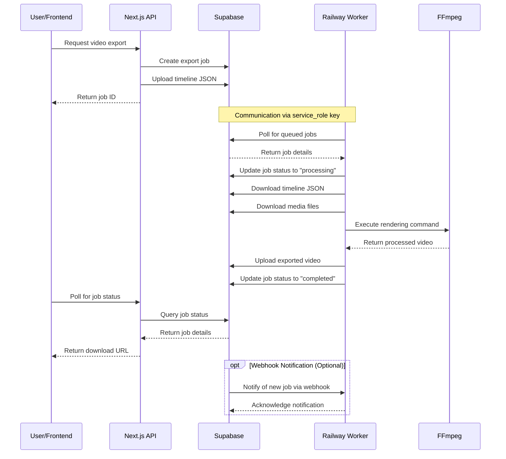

# Supabase and Railway Integration Guide

This guide explains how to set up the connection between Supabase and Railway for the OpenCut video export system.

## Communication Flow



## Prerequisites

- A Supabase account and project
- A Railway account
- Git repository with the Dreamcut codebase

## Step 1: Set Up Supabase

### Create Required Tables

1. Run the migration script to create the `export_jobs` table:

```sql
-- Create export_jobs table
CREATE TABLE IF NOT EXISTS export_jobs (
  id UUID PRIMARY KEY,
  user_id UUID NOT NULL REFERENCES auth.users(id) ON DELETE CASCADE,
  project_id UUID NOT NULL,
  status VARCHAR(20) NOT NULL CHECK (status IN ('queued', 'processing', 'completed', 'failed')),
  width INTEGER NOT NULL,
  height INTEGER NOT NULL,
  fps INTEGER NOT NULL,
  duration FLOAT NOT NULL,
  progress INTEGER DEFAULT 0,
  download_url TEXT,
  error_message TEXT,
  created_at TIMESTAMP WITH TIME ZONE NOT NULL DEFAULT NOW(),
  completed_at TIMESTAMP WITH TIME ZONE
);

-- Add index for faster lookups by user
CREATE INDEX IF NOT EXISTS export_jobs_user_id_idx ON export_jobs(user_id);

-- Add index for project lookups
CREATE INDEX IF NOT EXISTS export_jobs_project_id_idx ON export_jobs(project_id);
```

### Create Storage Buckets

1. Navigate to Storage in your Supabase dashboard
2. Create the following buckets:
   - `export_data`: For storing timeline JSON data
   - `exports`: For storing exported video files

### Set Up RLS Policies

1. Enable Row Level Security on the `export_jobs` table
2. Add the following policies:

```sql
-- Users can only see their own export jobs
CREATE POLICY export_jobs_select_policy ON export_jobs
  FOR SELECT USING (auth.uid() = user_id);

-- Users can only insert their own export jobs
CREATE POLICY export_jobs_insert_policy ON export_jobs
  FOR INSERT WITH CHECK (auth.uid() = user_id);

-- Users can only update their own export jobs
CREATE POLICY export_jobs_update_policy ON export_jobs
  FOR UPDATE USING (auth.uid() = user_id);

-- Users can only delete their own export jobs
CREATE POLICY export_jobs_delete_policy ON export_jobs
  FOR DELETE USING (auth.uid() = user_id);
```

3. Add storage policies for the buckets:

```sql
-- export_data bucket policies
CREATE POLICY export_data_select_policy ON storage.objects
  FOR SELECT USING (
    bucket_id = 'export_data' AND 
    (storage.foldername(name))[1] = auth.uid()::text
  );

CREATE POLICY export_data_insert_policy ON storage.objects
  FOR INSERT WITH CHECK (
    bucket_id = 'export_data' AND 
    (storage.foldername(name))[1] = auth.uid()::text
  );

-- exports bucket policies
CREATE POLICY exports_select_policy ON storage.objects
  FOR SELECT USING (
    bucket_id = 'exports' AND 
    (storage.foldername(name))[1] = auth.uid()::text
  );

CREATE POLICY exports_insert_policy ON storage.objects
  FOR INSERT WITH CHECK (
    bucket_id = 'exports' AND 
    (storage.foldername(name))[1] = auth.uid()::text
  );
```

### Get Supabase API Keys

1. Go to Project Settings > API in your Supabase dashboard
2. Copy the following values:
   - **Project URL**: `https://your-project-id.supabase.co`
   - **service_role key**: This is your `SUPABASE_SERVICE_KEY`

> ⚠️ **Important**: The service_role key bypasses RLS policies and has full access to your database. Keep it secure and never expose it in client-side code.

## Step 2: Deploy the Worker to Railway

### Set Up Railway CLI

1. Install the Railway CLI:
```bash
npm i -g @railway/cli
```

2. Login to Railway:
```bash
railway login
```

### Create a Railway Project

1. Navigate to the export worker directory:
```bash
cd apps/export-worker
```

2. Initialize a new Railway project:
```bash
railway init
```

3. Follow the prompts to create a new project

### Configure Environment Variables

1. Set up the required environment variables:
```bash
railway variables set SUPABASE_URL=https://your-project-id.supabase.co
railway variables set SUPABASE_SERVICE_KEY=your-service-role-key
railway variables set POLL_INTERVAL=10000
railway variables set MAX_CONCURRENT_JOBS=2
railway variables set TEMP_DIR=/tmp/opencut-exports
```

### Deploy the Worker

1. Deploy the worker:
```bash
railway up
```

2. Get the deployment URL:
```bash
railway domain
```

3. This will output something like `https://your-worker-name.up.railway.app`

## Step 3: Configure Webhook (Optional)

For more efficient job processing, you can set up a webhook from Supabase to Railway:

1. Create a Supabase database function and trigger:

```sql
-- Function to call webhook when a new job is created
CREATE OR REPLACE FUNCTION notify_export_worker()
RETURNS TRIGGER AS $$
BEGIN
  PERFORM net.http_post(
    'https://your-worker-name.up.railway.app/webhook/new-job',
    '{"job_id": "' || NEW.id || '"}',
    '{"Content-Type": "application/json"}'
  );
  RETURN NEW;
END;
$$ LANGUAGE plpgsql SECURITY DEFINER;

-- Trigger to call the function on insert
CREATE TRIGGER export_job_created
AFTER INSERT ON export_jobs
FOR EACH ROW
EXECUTE FUNCTION notify_export_worker();
```

2. Enable the `http` extension if not already enabled:

```sql
CREATE EXTENSION IF NOT EXISTS "http";
```

## Step 4: Test the Integration

1. Create a test export job through the OpenCut UI
2. Check the Railway logs to see if the worker picks up the job:
```bash
railway logs
```
3. Monitor the job status in the Supabase dashboard
4. Verify that the exported video is uploaded to the `exports` bucket

## Troubleshooting

### Worker Not Processing Jobs

1. Check if the worker is running:
```bash
railway status
```

2. Verify environment variables:
```bash
railway variables
```

3. Check the worker logs:
```bash
railway logs
```

### Database Connection Issues

1. Verify that the Supabase URL and service key are correct
2. Check if the `export_jobs` table exists and has the correct schema
3. Test the connection manually:
```bash
curl -X GET https://your-worker-name.up.railway.app/health
```

### Storage Issues

1. Verify that the storage buckets exist
2. Check the storage policies to ensure the worker has access
3. Try uploading a test file to the buckets using the Supabase dashboard
