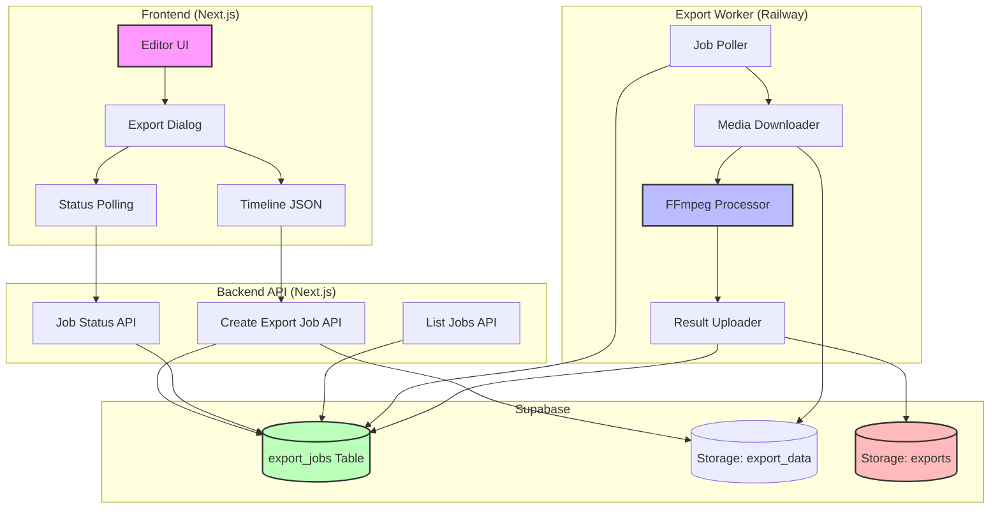

# Video Export System

This document describes the video export system for OpenCut, which renders timeline content to video files using FFmpeg on a backend worker.

## Architecture Overview



The export system consists of several components:

1. **Frontend (Next.js)**
   - Timeline editor UI
   - Export dialog
   - Job status polling

2. **Backend API (Next.js API Routes)**
   - Create export jobs
   - Check job status
   - List export jobs

3. **Export Worker (Node.js + FFmpeg)**
   - Polls for queued jobs
   - Downloads media files
   - Renders videos using FFmpeg
   - Uploads completed exports

4. **Storage (Supabase)**
   - Timeline data
   - Media files
   - Exported videos

## Data Flow

1. User clicks "Export" in the editor UI
2. Frontend collects timeline data (project settings, tracks, media items)
3. API creates a job record and stores timeline data
4. Worker polls for new jobs and processes them
5. Frontend polls for job status updates
6. When complete, user can download the exported video

## Timeline JSON Format

The timeline data is structured as follows:

```json
{
  "project": {
    "id": "project-uuid",
    "name": "Project Name",
    "canvasSize": { "width": 1080, "height": 1920 },
    "fps": 30,
    "backgroundColor": "#000000"
  },
  "tracks": [
    {
      "id": "track-uuid",
      "name": "Main Track",
      "type": "media",
      "elements": [
        {
          "id": "element-uuid",
          "name": "Video Clip",
          "type": "media",
          "mediaId": "media-uuid",
          "startTime": 0,
          "duration": 5,
          "trimStart": 0,
          "trimEnd": 0
        }
      ]
    },
    {
      "id": "text-track-uuid",
      "name": "Text Track",
      "type": "text",
      "elements": [
        {
          "id": "text-element-uuid",
          "name": "Title",
          "type": "text",
          "content": "My Video",
          "startTime": 1,
          "duration": 3,
          "fontSize": 48,
          "fontFamily": "Arial",
          "color": "#FFFFFF",
          "x": 0,
          "y": 0
        }
      ]
    }
  ],
  "mediaItems": {
    "media-uuid": {
      "id": "media-uuid",
      "name": "video.mp4",
      "type": "video",
      "url": "https://example.com/video.mp4",
      "duration": 10,
      "width": 1920,
      "height": 1080
    }
  }
}
```

## FFmpeg Processing

The worker uses a complex FFmpeg filter graph to:

1. Create a base canvas with the project dimensions
2. Process each media element (videos, images)
3. Apply text overlays
4. Mix audio tracks
5. Encode the final video

Example FFmpeg command structure:

```
ffmpeg \
  -f lavfi -i "color=c=0x000000:s=1080x1920:r=30" \
  -i "video1.mp4" \
  -i "image1.png" \
  -filter_complex "
    [0:v]format=yuv420p,setsar=1[baseV];
    [1:v]scale=1080:1920:force_original_aspect_ratio=decrease,pad=1080:1920:(ow-iw)/2:(oh-ih)/2[v1];
    [baseV][v1]overlay=shortest=1:enable='between(t,0,5)'[bg1];
    [2:v]scale=500:-1[img1];
    [bg1][img1]overlay=x=50:y=50:enable='between(t,2,4)'[bg2];
    [bg2]drawtext=text='My Video':fontsize=48:fontcolor=white:x=(w-tw)/2:y=(h-th)/2:enable='between(t,1,4)'[v];
    [1:a]asetpts=PTS-STARTPTS[a]
  " \
  -map "[v]" -map "[a]" \
  -c:v libx264 -preset veryfast -crf 23 \
  -c:a aac -b:a 192k \
  output.mp4
```

## Database Schema

The `export_jobs` table has the following structure:

```sql
CREATE TABLE export_jobs (
  id UUID PRIMARY KEY,
  user_id UUID NOT NULL REFERENCES auth.users(id) ON DELETE CASCADE,
  project_id UUID NOT NULL,
  status VARCHAR(20) NOT NULL CHECK (status IN ('queued', 'processing', 'completed', 'failed')),
  width INTEGER NOT NULL,
  height INTEGER NOT NULL,
  fps INTEGER NOT NULL,
  duration FLOAT NOT NULL,
  progress INTEGER DEFAULT 0,
  download_url TEXT,
  error_message TEXT,
  created_at TIMESTAMP WITH TIME ZONE NOT NULL DEFAULT NOW(),
  completed_at TIMESTAMP WITH TIME ZONE
);
```

## Storage Buckets

The system uses the following Supabase Storage buckets:

- `export_data`: Stores timeline JSON data
- `exports`: Stores the final exported videos

## Deployment

### Railway Worker

The export worker is deployed on Railway with the following environment variables:

```
SUPABASE_URL=your-supabase-url
SUPABASE_SERVICE_KEY=your-supabase-service-key
POLL_INTERVAL=10000
MAX_CONCURRENT_JOBS=2
TEMP_DIR=/tmp/opencut-exports
```

## Error Handling

The system handles various error scenarios:

1. **Frontend validation**: Checks if the timeline has content before allowing export
2. **Job creation errors**: API returns appropriate error messages
3. **Processing errors**: Worker updates job status with error messages
4. **Media download failures**: Worker reports specific errors for missing media

## Future Improvements

- Support for more export formats (MP4, WebM, GIF)
- Quality presets (low, medium, high)
- Custom resolution options
- Export with/without audio
- Progress visualization with thumbnails
- Parallel processing of segments for faster exports
